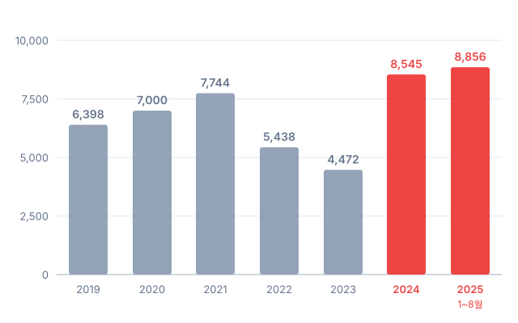
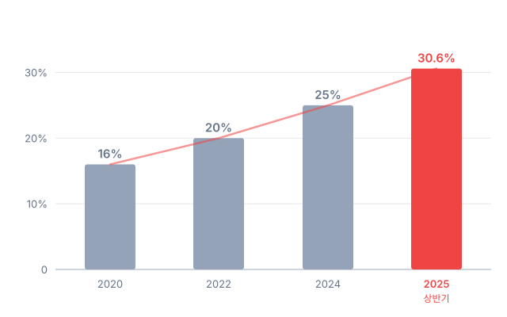
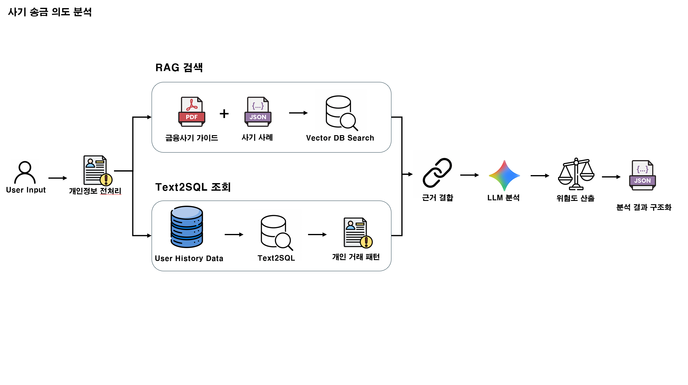

# 안심동행 AI

> **2026 금융 AI Challenge**

고령 부모의 위험 송금을 AI가 금융 데이터와 대화 분석으로 탐지하고, 가족이 함께 확인하며, 피해 발생 시 골든타임 대응부터 회복까지 함께하는 가족 금융안전 서비스.

한결은행(부모)·나눔은행(자녀) — 서로 다른 가상 은행 앱 안의 기능으로 구현.
가족이 같은 은행을 쓰지 않아도 연결된다는 점을 데모에서 그대로 보여준다.

## 왜 필요한가

대한민국은 2024년 말 초고령사회에 진입했습니다. 보이스피싱 피해는 2022~2023년 감소세를 보이다 **2024년 8,545억원으로 역대 최고치**를 기록, 2025년에는 8월까지만 8,856억원으로 이미 전년을 넘어섰습니다.

**보이스피싱 피해 금액 추이** (억원, 경찰청)

**60대 이상 피해 비율 추이** (%)

- 60대 이상 피해 비율 **30.6%** (2025 상반기) — 전 연령 중 1위, 10년간 피해 건수 **5배** 증가
- 2025년 1분기 기관사칭형 비율 **51%**로 급증 (전년 41% → +10%p)
- 기존 대응은 **방임**(사고 후 발견) vs **성년후견**(자기결정권 박탈)의 양극단

**안심동행 AI**는 이 사이에 존재하지 않던 **중간 단계**를 만듭니다. 감시가 아닌 동행으로, 부모님의 자기결정권을 지키면서 가족이 함께 보호합니다.

> 출처: 경찰청 보이스피싱 현황, 금융감독원 보도자료, 통계개발원 (2025)

## 아키텍처
┌──────────────────────────── 안심동행 AI 전체 방어 아키텍처 ────────────────────────────┐
│                                                                                         │
│  User 송금 시도                                                                          │
│      │                                                                                  │
│      ▼                                                                                  │
│  ┌──────────────────────────── 0. 악성 앱 탐지 ─────────────────────────────┐           │
│  │ - 원격제어 앱, 의심 앱, 악성 앱 설치 여부 확인                           │           │
│  │ - 사기범이 기기 제어권을 가진 상태인지 송금 전 1차 차단                  │           │
│  └──────────────────────────────┬───────────────────────────────────────────┘           │
│                                 ▼                                                       │
│  ┌──────────────────────────── 1. 상대방 검증 ──────────────────────────────┐           │
│  │ - 수취 계좌, 전화번호, 연락 채널 검증                                    │           │
│  │ - 처음 보는 계좌·개인 명의 계좌·의심 연락 경로 확인                     │           │
│  └──────────────────────────────┬───────────────────────────────────────────┘           │
│                                 ▼                                                       │
│  ┌──────────────────────────── 2. 행동 이상 감지 ───────────────────────────┐           │
│  │ - 한도 상향 직후 송금, 반복 입력, 뒤로가기, 긴 세션 감지                 │           │
│  │ - 평소와 다른 조작 패턴을 행동 위험 신호로 반영                          │           │
│  └──────────────────────────────┬───────────────────────────────────────────┘           │
│                                 ▼                                                       │
│  ┌──────────────────────────── 3. 거래 위험 분석 ───────────────────────────┐           │
│  │ - 고액 송금, 최초 수취인, 야간 송금, 본인 계좌 여부 분석                 │           │
│  │ - 거래 자체의 위험 점수를 산출                                           │           │
│  └──────────────────────────────┬───────────────────────────────────────────┘           │
│                                 ▼                                                       │
│  ┌──────────────────────────── 4. 사기 송금 의도 분석 ──────────────────────┐           │
│  │ - 사용자 발언과 송금 사유 입력                                           │           │
│  │ - 개인정보 전처리 후 RAG 검색과 거래 패턴 조회를 병렬 실행              │           │
│  │ - 금융사기 근거 + 개인 거래 패턴을 결합해 LLM이 의도 분석               │           │
│  │ - 위험도, 사기 유형, 판단 사유, nextAction을 JSON으로 구조화            │           │
│  └──────────────────────────────┬───────────────────────────────────────────┘           │
│                                 │                                                       │
│                  ┌──────────────┴──────────────┐                                        │
│                  ▼                             ▼                                        │
│        위험 낮음: 정상 송금 진행        고위험: 가족 공동확인 단계 이동                 │
│                                                │                                        │
│                                                ▼                                        │
│  ┌──────────────────────────── 5. 가족 공동확인 ────────────────────────────┐           │
│  │ - 검증된 자녀에게 금액·받는 계좌·위험 사유만 최소 공유                  │           │
│  │ - 자녀는 승인/보류 의견만 제공                                           │           │
│  │ - 부모의 잔액, 전체 거래내역, 인증정보는 공유하지 않음                  │           │
│  │ - 최종 송금 결정권은 부모에게 유지                                      │           │
│  └──────────────────────────────┬───────────────────────────────────────────┘           │
│                                 │                                                       │
│                  ┌──────────────┴──────────────┐                                        │
│                  ▼                             ▼                                        │
│        부모 최종 결정 후 종료            이미 송금한 경우 피해 대응 이동                │
│                                                │                                        │
│                                                ▼                                        │
│  ┌──────────────────────────── 6. 골든타임 피해 대응 ───────────────────────┐           │
│  │ - 지급정지 요청, 112 신고, 피해구제 신청, 증거 보관 절차 안내           │           │
│  │ - MVP에서는 실제 기관 접수 보장이 아니라 모바일뱅킹식 가상 접수 흐름    │           │
│  │ - 접수 내역은 안심동행 AI 페이지에 저장                                  │           │
│  └──────────────────────────────────────────────────────────────────────────┘           │
│                                                                                         │
└─────────────────────────────────────────────────────────────────────────────────────────┘

## 사기 송금 의도 분석

의심 송금 상황과 송금 이유를 입력하면, 민감정보를 먼저 전처리한 뒤 RAG 검색과 Text2SQL 조회를 병렬로 수행한다. 이후 금융사기 근거와 개인 거래 패턴을 결합해 LLM이 사기 송금 의도를 분석하고, 위험도와 다음 보호 단계를 JSON 형태로 구조화한다.

