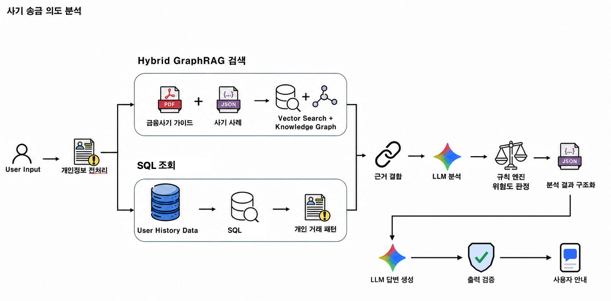

# 2026 금융 AI Challenge

---

## 서비스 소개

> 안심동행 AI

안심동행 AI는 고령 부모의 위험 송금을 AI가 금융 데이터와 대화 맥락으로 분석 및 탐지하고, 가족이 함께 확인할 수 있도록 돕는 금융사기 예방 서비스입니다.

---

## 핵심 기능

| 기능 | 설명 |
| --- | --- |
| **상대방 검증** | 전화번호, 문자 링크, 금융회사 정보와 송금 상대방을 확인하여 기관 사칭, 악성 URL, 신고 이력 등의 위험 신호를 탐지합니다. |
| **행동 감지** | 평소 거래 패턴과 현재 행동을 비교하여 신규 수취인, 이례적인 송금액, 이체 한도 변경, 통화 중 송금 등의 이상 징후를 감지합니다. |
| **가족 공동 확인** | 위험 거래가 감지되면 연결된 가족에게 최소한의 거래 정보를 전달합니다. 가족이 함께 상황을 확인하되 최종 송금 결정은 부모가 직접 내립니다. |
| **사기 송금 의도 분석** | AI가 사용자와 대화하며 연락 주체, 송금 목적, 상대방의 요구와 비밀 유지·긴급성·기관 사칭 등의 위험 신호를 분석합니다. |
| **피해 대응** | 이미 송금했거나 개인정보가 노출된 상황을 구분하고, 지급정지 요청부터 경찰 신고 초안, 피해구제 신청, 증거 보존까지 단계별로 안내합니다. |

---

## Pipeline

### 사기 송금 의도 분석

---

## 기술 스택

| 구분 | 적용 기술 |
| --- | --- |
| Frontend | React 19, TypeScript, Vite, Tailwind CSS |
| Backend | Node.js, Vercel Functions |
| AI | Google Gemini API, Embedding, RAG |
| Database | Supabase PostgreSQL |
| Knowledge Graph | Neo4j AuraDB |
| External API | 금융위원회 OpenAPI, Google Safe Browsing, NAVER Search |
| Deployment | Vercel |

---

## Dataset

### PDF

| 출처 | 자료 |
| --- | --- |
| 금융투자협회 | 행복 금융투자 길라잡이 |
| 금융보안원 | Operation BlackEcho |
| 전국은행연합회 | 사기 예방 백과사전 |
| 한국금융소비자보호재단 | 보이스피싱 알아야 막을 수 있다! 피해 사례와 예방법 |
| 보험연구원 | 중고령소비자의 금융역량 진단과 강화방안 |
| 금융감독원·DAXA | 가상자산 연계 투자사기 사례집 |
| 법제처 | 전자금융범죄 |
| 대검찰청·한국형사법무정책연구원 | 보이스피싱 피해자의 심리분석을 통한 피해예방연구 |
| 개인정보보호위원회 | 2026 개인정보 처리방침 작성지침 |
| 개인정보보호위원회 | 생성형 인공지능(AI) 개발·활용을 위한 개인정보 처리 안내서 |
| 금융보안원 | 금융분야 AI 보안 가이드라인 |
| 금융위원회 | 금융분야 인공지능 가이드라인 |

### JSON

| 출처 | 자료 |
| --- | --- |
| 과학기술정보통신부·공공데이터포털 | 스팸·해킹·피싱 전화상담 데이터셋 1종 |
| 과학기술정보통신부·공공데이터포털 | 스팸·해킹·피싱 전화상담 데이터셋 2종 |
| 과학기술정보통신부·공공데이터포털 | 스팸·해킹·피싱 전화상담 데이터셋 3종 |
| 한국인터넷진흥원·공공데이터포털 | 전화상담 가명정보 현황 |
| AI Hub | 금융분야 고객상담 데이터 |
| 공식 금융사기 자료와 KISA 상담 데이터를 기반으로 자체 구축 | 금융사기 지식그래프 및 위험 신호 분류 데이터 |
| 금융회사·공공기관 공식 홈페이지를 기반으로 자체 정리 | 공식 연락처 데이터 |
| 금융감독원 보이스피싱지킴이·금융감독원 공식 YouTube | 금융사기 공식 콘텐츠 데이터 |

### CSV

| 출처 | 자료 |
| --- | --- |
| 공공데이터포털 「한국인터넷진흥원 피싱사이트」 | 피싱사이트 URL 데이터 |
| 공모전 시연을 위해 자체 생성 | 가상 사용자 데이터 |
| 공모전 시연을 위해 자체 생성 | 가상 금융거래 데이터 |
