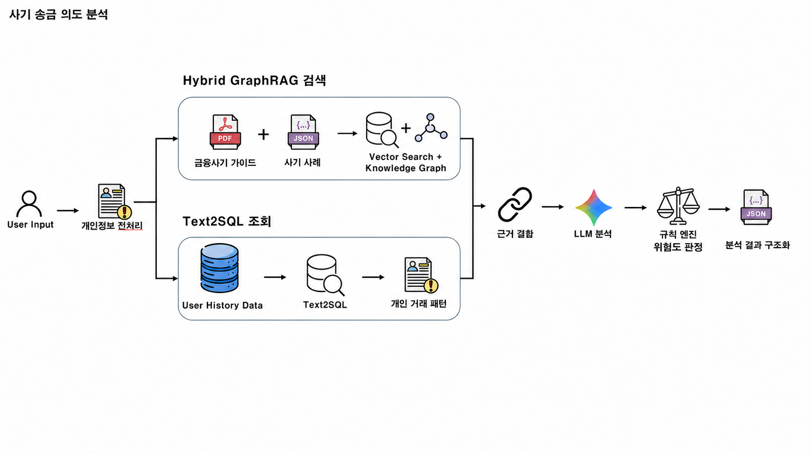

# 4단계 사기 송금 의도 분석 — 전체 구현·계획 및 MacBook 인수인계

> 최종 점검일: 2026-08-31  
> 프로젝트: 안심동행 AI / `C:\AI_Challenge`  
> 대상 모듈: `backend/agents/4-intent-analysis`  
> 목적: Windows에서 진행한 4단계 구현을 MacBook에서 그대로 이어가기 위한 기술 인수인계 문서

## 1. 현재 결론

4단계 사기 송금 의도 분석은 다음 파이프라인까지 실제 구현됐다.

```text
송금 정보·사용자 대화
  → 개인정보 마스킹
  → [병렬 1] JSON·PDF Vector RAG + Neo4j 지식그래프
  → [병렬 2] Supabase 최근 12개월 개인 거래 패턴 조회
  → 근거 결합
  → Gemini 의도·위험 신호 구조화
  → 서버 규칙 엔진 위험도 판정
  → Gemini 고령자용 자연어 답변
  → 출력 검증·안전 폴백
  → 구조화 JSON 반환
```



2026-08-31 실연결 검증 결과:

- 단위 테스트: **29/29 통과**
- 프론트엔드 TypeScript·Vite 빌드: **통과**
- 백엔드 의존성 감사: **취약점 0건**
- Neo4j AuraDB: **노드 128개, 관계 253개, 원본 JSON 대조 PASS**
- Supabase: **가상 사용자 3명, 거래 1,005건, 이상·정상 패턴 검증 PASS**
- Hybrid GraphRAG E2E: **JSON + PDF + Vector + Graph + Text2SQL + Gemini 최종 답변 PASS**
- 최종 E2E 예시: 기관사칭 안전계좌 송금 `HIGH 100점`, JSON 근거 3개, PDF 근거 4개, 그래프 경로 3개

핵심 원칙은 다음 두 문장이다.

> **Rules decide, AI explains.**  
> LLM은 신호를 추출하고 설명하지만, 위험 점수와 송금 보류는 서버 규칙이 결정한다.

RAG는 Gemini를 추가 학습하는 기능이 아니다. 현재 대화와 가까운 공식 문서·상담 사례·정상 대조 사례를 검색해 Gemini 입력 근거로 제공한다.

---

## 2. 해결하려는 문제와 4단계의 범위

### 목표

고령 부모가 처음 보는 계좌로 큰돈을 보내려 할 때 단순히 계좌 신고 이력만 확인하지 않고 다음을 함께 본다.

- 누구의 요구로 보내는가
- 어떤 경로로 연락받았는가
- 상대가 어떤 행동을 요구했는가
- 답변이 앞뒤로 달라지는가
- 공식 사기 사례의 진행 흐름과 닮았는가
- 평소 거래 금액·수취인·시간대와 얼마나 다른가

### 4단계가 담당하는 것

- 개인정보 마스킹
- 대화 기반 송금 목적 확인
- 사기·정상 사례와 공식 문서 검색
- Neo4j 관계 경로 검색
- 개인 거래 패턴 비교
- 위험 신호 추출
- 규칙 기반 점수·등급·보류 판정
- 고령자가 읽기 쉬운 자연어 설명
- 다음 단계가 사용할 구조화 결과 반환

### 4단계가 담당하지 않는 것

- 실제 송금 실행 또는 취소
- 실제 금융회사 지급정지 접수
- 자녀의 최종 승인 권한 결정
- 피해구제 신청 제출
- 실제 신고 DB·악성 앱 탐지

가족 공동확인은 5단계, 지급정지·신고·피해구제는 6단계가 담당한다. MVP에서 실제 기관 접수와 신고 DB 연동은 가상 처리임을 UI에 명시한다.

---

## 3. 확정된 설계 원칙

1. **위험 판정은 규칙 엔진이 담당한다.**
   Gemini의 위험 점수나 `done` 의견을 그대로 믿지 않는다.

2. **사기 후보와 정상 대조군을 함께 검색한다.**
   단어가 비슷하다는 이유만으로 정상 금융상담을 사기로 몰지 않는다.

3. **Vector DB와 Graph DB는 역할이 다르다.**
   Vector Search는 의미가 비슷한 사례·공식 문서를 찾고, Neo4j는 `접근 → 신뢰 형성 → 금전 요구 → 피해` 관계 흐름을 찾는다.

4. **Text2SQL은 거래 패턴 보조 근거다.**
   고액·신규 계좌라는 이유만으로 사기를 확정하지 않는다. 대화에서 위험 신호가 확인됐을 때만 개인 패턴 점수를 결합한다.

5. **현재 Text2SQL은 LLM 자유 SQL이 아니다.**
   대회 MVP의 보안·재현성을 위해 파라미터화된 읽기 전용 SQL을 사용한다. 자연어로 쿼리를 생성하지 않아 SQL Injection과 잘못된 조회 위험을 줄였다.

6. **LLM이 Cypher를 생성하지 않는다.**
   규칙으로 확인한 신호·채널·사칭대상·요구행동만 고정 Cypher의 파라미터로 전달한다.

7. **고령자 답변은 짧은 의미 단위로 나눈다.**
   한 문장마다 기계적으로 줄바꿈하지 않고, 한 핵심당 1~2문장의 짧은 문단으로 구성한다.

8. **필요한 정보가 남아 있으면 질문 횟수보다 정확성을 우선한다.**
   4턴은 권장 범위이고 강제 종료 기준이 아니다. 모델 오류로 인한 무한 반복만 8턴에서 막는다.

9. **내부 근거 출처는 사용자 답변에 그대로 노출하지 않는다.**
   `은행연합회 9쪽`, `Vector DB`, `Neo4j`, `SQL` 같은 내부 표현 없이 근거의 의미만 자연스럽게 설명한다.

10. **외부 서비스 장애 시에도 상담을 멈추지 않는다.**
    Vector → 로컬 IDF 검색, Neo4j → Vector만 사용, Text2SQL → 패턴 점수 제외, Gemini → 서버 규칙 안전 문구로 폴백한다.

---

## 4. 현재 코드 구조

```text
backend/agents/4-intent-analysis/
├─ README.md
├─ MACBOOK_HANDOFF.md
├─ agent.js                         # 4단계 공개 실행 진입점
├─ intent.js                        # 병렬 조회·질문·판정·최종 반환
├─ sanitize.js                      # 개인정보 마스킹·안전한 송금 문맥 생성
├─ assets/
│  └─ intent-analysis-pipeline.png
├─ llm/
│  └─ gemini.js                     # 1차 신호 추출, 2차 자연어 설명
├─ retrieval/
│  ├─ rag.js                        # Vector·Graph 결합과 키워드 폴백
│  ├─ vector-search.js              # 로컬 코사인 유사도 검색
│  ├─ gemini-embeddings.js          # Gemini 임베딩
│  ├─ neo4j-client.js               # Aura Query API·타임아웃·회로 차단
│  ├─ neo4j-search.js               # 고정 Cypher 관계 검색
│  └─ official-content.js           # 유형별 공식 확인 콘텐츠
├─ text2sql/
│  ├─ client.js                     # Supabase PostgreSQL 서버 연결
│  └─ transaction-pattern.js        # 최근 12개월 패턴 조회·점수 계산
├─ rules/
│  ├─ signals.js                    # 위험 신호별 점수·등급·질문 상한
│  └─ fraud-types.js                # 사기 유형 분류
├─ datasets/
│  ├─ README.md
│  ├─ SOURCES.md
│  ├─ rag/
│  │  ├─ input/                     # 마스킹·변환된 입력
│  │  ├─ cases/                     # 검수 가능한 지식·사례 원본
│  │  └─ runtime/                   # 실행 Corpus, 로컬 벡터 인덱스
│  └─ text2sql/                     # Supabase 스키마·가상 CSV
├─ scripts/                         # 생성·적재·검증 스크립트
└─ test/
   ├─ intent-analysis.test.mjs
   └─ eval.mjs
```

프론트 연결 파일:

- `frontend/src/api/guardian.ts`: `/api/intent` 호출과 응답 타입
- `frontend/src/screens/Transfer.tsx`: 송금 확인 채팅 화면
- `frontend/src/shared/intentChat.ts`: 고령자용 답변 구역화
- `frontend/vite.config.ts`: 개발 서버의 `/api/intent` 백엔드 프록시

---

## 5. 상세 실행 흐름

### 5.1 입력

프론트는 다음 형태를 `/api/intent`에 POST한다.

```json
{
  "transfer": {
    "userId": "demo-parent-01",
    "sourceAccount": "원 계좌 식별값",
    "occurredAt": "2026-08-31T09:00:00.000Z",
    "amount": 12000000,
    "recipientName": "수취인 표시명",
    "account": "수취 계좌",
    "bank": "은행명",
    "isFirstTransfer": true,
    "patternRiskScore": 0,
    "reportedAccount": false,
    "callInProgress": true
  },
  "messages": [
    { "role": "ai", "text": "처음 보내는 계좌예요. 어떤 돈인지 여쭤봐도 될까요?" },
    { "role": "user", "text": "검찰이 안전계좌로 옮기라고 했어요." }
  ],
  "turn": 1
}
```

### 5.2 개인정보 전처리

`sanitize.js`가 다음 값을 LLM과 검색 전에 치환한다.

- 주민등록번호 → `[주민번호]`
- 전화번호 → `[전화번호]`
- 이메일 → `[이메일]`
- URL → `[링크]`
- 계좌 형태의 긴 번호 → `[계좌·긴번호]`

수취 계좌 원문은 넘기지 않고 은행명과 수취인 표시명으로 만든 비가역성 경량 참조값 `acct_xxxxxxxx`을 사용한다. 데모 사용자 ID는 `demo-parent-01`~`03`만 허용한다.

### 5.3 병렬 조회

`intent.js`는 `Promise.all`로 두 큰 작업을 병렬 실행한다.

```text
A. retrieveIntentContext()
   ├─ Gemini Vector Search
   ├─ 로컬 IDF 보완 검색
   └─ Neo4j 관계 검색

B. retrieveTransactionPattern()
   └─ Supabase PostgreSQL 최근 12개월 거래 패턴 조회
```

### 5.4 RAG 검색

질문은 마스킹된 사용자 답변과 다음 송금 문맥을 결합한다.

- 고액 송금 여부
- 처음 보내는 계좌인지
- 상대와 통화 중인지

각 질의에서 기본적으로 다음을 가져온다.

- 사기 문맥 후보 Top 3
- 정상 금융상담 대조군 Top 3
- 공식 PDF 페이지 Top 4
- Neo4j 관련 사기 경로 Top 3

벡터 결과가 부족하면 로컬 IDF 검색 결과로 채운다. 임베딩 API나 인덱스가 없으면 전체를 IDF 검색으로 전환한다.

### 5.5 개인 거래 패턴 조회

Supabase에서 현재 송금 직전 최근 12개월의 출금·송금 기록을 조회한다.

조회 항목:

- 평균·중앙값·최대 송금액
- 해당 수취인에게 보낸 횟수
- 평소 주요 송금 시간
- 가족·주거·소비 거래 빈도
- 현재 거래와의 차이

패턴 점수:

| 조건 | 점수 |
|---|---:|
| 최근 12개월에 보내지 않은 수취인 | +10 |
| 과거 최대 송금액의 2배 이상 | +15 |
| 최대 기준이 없고 평균 송금액의 4배 이상 | +10 |
| 과거에 없던 1천만원 이상 고액 송금 | +10 |
| 평소와 크게 다른 심야 송금 | +5 |
| 최대 합계 | 40 |

패턴 점수만 있고 대화 위험 신호가 하나도 없으면 최종 위험 점수는 0점이다.

### 5.6 Gemini 1차 호출: 의도와 신호 추출

Gemini는 다음을 구조화한다.

- 송금 목적
- 요청자
- 연락 경로
- 사칭 대상
- 상호작용 방향
- 공격 단계
- 상대가 요구한 행동
- 위험 신호 코드
- 사용자 답변 간 모순
- 아직 필요한 정보
- 실제 사용자 표현
- 판단에 사용한 검색 근거 ID

검색 사례는 비교 자료일 뿐 정답으로 취급하지 않는다. 현재 대화에 직접 나온 사실만 추출하도록 제한한다.

### 5.7 규칙 엔진 판정

주요 신호 점수:

| 신호 | 점수 |
|---|---:|
| 안전계좌 송금 요구 | 50 |
| 가족에게 말하지 말라는 요구 | 40 |
| 선입금·앱 설치·인증정보·통화 유지·수익 보장·추가 입금 | 각 30 |
| 악성 링크·개인정보·기관사칭·개인계좌 요구·답변 모순·가족 새 번호 | 각 25 |
| 확인 회피 | 20 |
| 긴급 재촉 | 15 |
| 의심 문자 접근 | 10 |

등급:

- `HIGH`: 50점 이상
- `MEDIUM`: 30~49점
- `LOW`: 0~29점
- 최종 점수 상한: 100점

사기 유형 9개:

1. 은행·기관 사칭
2. 대출 선입금
3. 환급·당첨금 선입금
4. 가족·지인 사칭
5. 스미싱
6. 악성 앱·원격제어
7. 개인정보 피싱
8. 투자 사기
9. 부업·미션형 사기

### 5.8 추가 질문 로직

질문은 육하원칙을 한꺼번에 묻지 않는다. 현재 근거에서 가장 중요한 공백 하나만 묻는다.

우선순위:

1. 앱 설치·원격제어 여부
2. 링크 클릭 여부
3. 비밀번호·인증번호·신분증 제공 여부
4. 이미 송금했는지
5. 누가 요구했는지
6. 연락 경로와 실제 번호
7. 무엇을 하라고 했는지
8. 누구 계좌로 보내라고 했는지

금액·신규 수취인처럼 송금 화면이 이미 아는 정보는 다시 묻지 않는다. 한 AI 응답에는 질문을 하나만 둔다.

- 일반 최소 확인: 3턴
- 명백한 HIGH: 필요한 근거가 채워지면 2턴부터 판정 가능
- 4턴: 권장 범위일 뿐 종료 기준 아님
- 8턴: 모델 오류에 의한 무한 반복 방지 상한

### 5.9 Gemini 2차 호출: 최종 사용자 답변

규칙 판정 뒤 두 번째 Gemini가 다음 근거를 받아 자연어를 만든다.

- 사용자의 실제 표현
- 규칙 엔진의 위험 등급과 신호
- 사기·정상 사례
- 공식 PDF 근거
- Neo4j 진행 관계
- Supabase 개인 거래 패턴
- 반드시 포함할 안전 행동

개인 패턴 위험 점수가 20점 이상이면 최종 답변의 `왜 위험한가요`에 다음을 반드시 자연스럽게 포함한다.

- 현재 송금액
- 평소 최대 또는 평균 송금액
- 신규 수취인 여부

누락되면 Gemini를 한 번 재호출한다. 그래도 빠지면 백엔드가 계산값으로 비교 문장을 안전하게 삽입한다.

예시:

```text
확인한 내용이에요
검찰 수사관이라는 사람이 070 전화로 통화를 끊지 못하게 하며
안전계좌 송금을 요구하셨군요.

왜 위험한가요
국가기관은 전화로 안전계좌 송금을 요구하지 않아요.
이번 송금은 1,200만원으로 평소 가장 큰 송금 70만원보다 훨씬 크고,
처음 보내는 계좌라 더 확인해야 해요.

지금 해야 할 일이에요

1. 송금하지 말고 통화를 먼저 끊으세요.

2. 상대가 알려준 번호가 아닌 공식 번호로 직접 확인하세요.

3. 안전계좌나 개인 명의 계좌 송금 요구에 응답하지 마세요.

4. 대화·문자·번호·계좌를 보관하고 112 또는 1332에 신고하세요.
```

### 5.10 출력 검증과 반환

출력 검증은 다음을 차단한다.

- `100% 사기`, `확실한 사기` 같은 과도한 단정
- 내부 문서명·페이지·DB·SQL·그래프 표현 노출
- 너무 긴 문장과 과도한 문단
- 질문 모드에서 여러 질문 동시 출력
- 위험 답변에서 필수 4단계 행동 누락
- 개인 거래 비교가 필요한데 누락된 답변

최종 반환 주요 값:

```json
{
  "message": "고령자용 답변",
  "hold": true,
  "done": true,
  "risk": {
    "score": 100,
    "level": "HIGH",
    "labels": ["안전계좌로 옮기라는 요구"]
  },
  "intent": {
    "purpose": "",
    "requester": "",
    "channel": ""
  },
  "analysis": {
    "version": "intent-analysis-v3",
    "suspected_fraud_type": {},
    "retrieval": {
      "fraud_evidence": [],
      "normal_evidence": [],
      "official_document_evidence": [],
      "transaction_pattern": {},
      "knowledge_graph": {}
    }
  },
  "fallback": false
}
```

---

## 6. RAG 데이터 현황

### 6.1 현재 실행 데이터 수치

저장소 파일을 2026-08-31 다시 집계한 값이다.

| 구분 | 수량 |
|---|---:|
| 전체 실행 Corpus | 1,541건 |
| KISA 사기 문맥 후보 | 391건 |
| AI Hub 정상 금융상담 대조군 | 400건 |
| 공식 PDF 페이지 | 750건 |
| 공식 원문 텍스트 추출 | 696쪽 |
| 이미지 요약 후 검수 필요 | 54쪽 |
| 전체 벡터 청크 | 1,700개 |
| JSON 벡터 청크 | 825개 |
| PDF 벡터 청크 | 875개 |
| 임베딩 모델 | `gemini-embedding-001` |
| 임베딩 차원 | 768 |
| 최대 청크 | 1,400자 |
| 청크 중첩 | 160자 |
| 기본 유사도 하한 | 0.32 |

### 6.2 JSON 5종

1. KISA 스팸·해킹·피싱 전화상담 기반 합성데이터 1종
2. KISA 스팸·해킹·피싱 전화상담 기반 합성데이터 2종
3. KISA 스팸·해킹·피싱 전화상담 기반 합성데이터 3종
4. KISA 118 전화상담 가명정보
5. AI Hub 금융분야 고객상담 데이터

역할:

- KISA: 사기 의도·피해자 표현·요구 행동 후보
- AI Hub: 정상적인 금융 목적 대화 대조군
- 자동 후보·합성·가명 데이터는 실제 사건의 확정 정답으로 표현하지 않음

### 6.3 PDF 8종

1. 금융투자협회 `행복 금융투자 길라잡이`
2. 금융보안원 `Operation BlackEcho`
3. 전국은행연합회 `사기 예방 백과사전`
4. 한국금융소비자보호재단 `보이스피싱 알아야 막을 수 있다!`
5. 보험연구원 `중고령소비자의 금융역량 진단과 강화방안`
6. 금융감독원·DAXA `가상자산 연계 투자사기 사례집`
7. 법제처 `전자금융범죄`
8. 대검찰청·한국형사법무정책연구원 `보이스피싱 피해자의 심리분석을 통한 피해예방연구`

파일명과 공식 다운로드 링크는 [datasets/SOURCES.md](./datasets/SOURCES.md)에 정리돼 있다. 원본 PDF는 저장소에 넣지 않는다.

문서별 페이지 수:

| 문서 | 페이지 |
|---|---:|
| Operation BlackEcho | 203 |
| 보이스피싱 피해자 심리분석 연구 | 131 |
| 금융투자 길라잡이 | 126 |
| 중고령 금융역량 | 84 |
| 사기 예방 백과사전 | 70 |
| 전자금융범죄 | 61 |
| 가상자산 투자사기 사례집 | 39 |
| 보이스피싱 사례·예방법 | 36 |

텍스트 레이어가 없는 페이지는 Gemini 이미지 요약으로 보완하지만 원문 OCR로 간주하지 않는다. `official_source_llm_summary_needs_review` 상태를 유지한다.

---

## 7. Neo4j AuraDB 지식그래프

### 역할

Vector Search가 비슷한 문장을 찾는다면 Neo4j는 다음 관계를 찾는다.

```text
사기 유형
  ├─ 위험 신호
  ├─ 연락 채널
  ├─ 사칭 대상
  ├─ 요구 행동
  ├─ 공격 단계와 순서
  └─ 안전 대응 행동
```

### 현재 적재 상태

| 노드 | 수량 |
|---|---:|
| FraudType | 9 |
| RiskSignal | 16 |
| Channel | 5 |
| Impersonator | 10 |
| RequestedAction | 11 |
| AttackStage | 5 |
| AttackStep | 36 |
| SafetyAction | 36 |
| 전체 | 128 |

관계 총 253개:

- `HAS_SIGNAL` 38
- `USES_CHANNEL` 28
- `IMPERSONATES` 24
- `REQUESTS` 28
- `HAS_STEP` 36
- `AT_STAGE` 36
- `NEXT_STEP` 27
- `RECOMMENDS` 36

검수 가능한 원본은 `datasets/rag/cases/fraud-knowledge-graph.json`이다. 적재는 `MERGE`를 사용해 재실행해도 중복되지 않는다.

### 안전 설계

- LLM 자유 Cypher 생성 금지
- 파라미터화된 고정 Cypher만 사용
- 기본 타임아웃 1,500ms
- 실패 후 30초 회로 차단
- 장애 시 Vector RAG만 사용
- 대회 배포에서는 로컬 Docker가 아니라 AuraDB Free 사용

---

## 8. Supabase Text2SQL 거래 패턴

### 데이터

최근 12개월의 완전한 가상 거래 데이터다.

| 사용자 | 거래 수 | 대표 패턴 |
|---|---:|---|
| `demo-parent-01` | 369 | 급여·가족·주거·소비 중심 |
| `demo-parent-02` | 348 | 연금·생활비 중심 |
| `demo-parent-03` | 288 | 자영업·가족·소비 중심 |
| 전체 | 1,005 | 모두 `is_synthetic=true` |

파일:

- `datasets/text2sql/synthetic-users.csv`
- `datasets/text2sql/synthetic-transactions.csv`
- `datasets/text2sql/schema.sql`

테이블:

- `public.demo_users`
- `public.transactions`

보안:

- 두 테이블 모두 RLS 활성화
- `anon`, `authenticated` 직접 권한 회수
- 브라우저에서 DB URL을 사용하지 않음
- `SUPABASE_DATABASE_URL`은 서버 전용
- SQL은 파라미터화된 SELECT만 사용

실검증 예시:

- 사용자: `demo-parent-01`
- 현재 송금: 신규 수취인에게 1,200만원
- 평소 평균: 533,333원
- 평소 최대: 700,000원
- 기존 수취인 이력: 없음
- 패턴 위험 점수: 35점
- 이유: 신규 수취인 + 최대의 2배 이상 + 과거에 없던 1천만원 이상 송금
- 같은 사용자의 평소 기존 수취인 송금: 0점

---

## 9. 외부 서비스 장애와 폴백

| 장애 | 동작 |
|---|---|
| Gemini 임베딩 실패 | 로컬 IDF 가중 키워드 검색 |
| 벡터 인덱스 없음 | 로컬 IDF 검색 |
| Neo4j 미설정·실패 | Vector RAG만 사용 |
| Supabase 미설정·실패 | 개인 패턴 점수 없이 기존 판정 유지 |
| Gemini 1차 분석 실패 | 로컬 정규식 신호·규칙 엔진으로 질문 또는 판정 |
| Gemini 2차 답변 실패 | 검증된 고정 안전 문구 |
| 프론트에서 API 연결 실패 | 안전 우선 보류 응답 |

주의: 폴백은 데모 중단 방지용이다. 운영 단계에서는 장애율·응답시간·폴백 발생 사유를 감사로그로 남겨야 한다.

---

## 10. MacBook 이전 전 반드시 할 일

현재 Git 상태:

- 브랜치: `main`
- 현재 HEAD: `438c623`
- 원격: `https://github.com/EncryH/PFA_Agent.git`
- 2026-08-31 기준 추적·미추적 변경 파일이 **31개** 남아 있다.
- Neo4j·Supabase·자연어 비교 답변의 최신 구현 일부는 아직 커밋되지 않았다.

따라서 Mac에서 `git clone`만 하면 현재 Windows 작업 전체가 오지 않는다. 먼저 작업별로 커밋하고 push하거나, 저장소 폴더 전체를 안전하게 복사해야 한다.

`.DS_Store`, `.env`, 벡터 인덱스, 원본 PDF는 커밋하지 않는다.

---

## 11. MacBook 설치 절차

### 11.1 저장소 받기

```bash
git clone https://github.com/EncryH/PFA_Agent.git AI_Challenge
cd AI_Challenge
git status
git log -5 --oneline
```

Windows 변경을 push하기 전이라면 clone하지 말고 최신 폴더를 직접 옮긴 뒤 `git status`로 누락을 확인한다.

### 11.2 Node.js

Windows 검증 환경은 Node `v24.14.0`, npm `11.9.0`이다. 동일 환경을 쓰는 것이 가장 안전하다.

```bash
brew install nvm
mkdir -p ~/.nvm
export NVM_DIR="$HOME/.nvm"
source "$(brew --prefix nvm)/nvm.sh"
nvm install 24
nvm use 24
node -v
npm -v
```

### 11.3 의존성 설치

```bash
cd backend
npm ci
cd ../frontend
npm ci
cd ..
```

현재 백엔드 런타임 의존성은 `postgres@3.4.9`이며 lockfile이 있다.

### 11.4 루트 `.env`

`.env.example`을 복사하고 실제 값은 비밀번호 관리자나 암호화된 개인 경로로 옮긴다. 메신저·Git·문서에 실제 값을 넣지 않는다.

```bash
cp .env.example .env
```

```dotenv
GEMINI_API_KEY=<GEMINI_API_KEY>
GEMINI_MODEL=gemini-3.6-flash
GEMINI_RESPONSE_MODEL=gemini-3.6-flash
GEMINI_EMBEDDING_MODEL=gemini-embedding-001
GEMINI_EMBEDDING_DIMENSIONS=768
VECTOR_RAG_MIN_SIMILARITY=0.32
GEMINI_THINKING_LEVEL=minimal

NEO4J_ENABLED=true
NEO4J_URI=neo4j+s://<DB_ID>.databases.neo4j.io
NEO4J_USERNAME=neo4j
NEO4J_PASSWORD=<AURA_DB_PASSWORD>
NEO4J_DATABASE=neo4j
NEO4J_TIMEOUT_MS=1500

TEXT2SQL_ENABLED=true
SUPABASE_DATABASE_URL=postgresql://postgres.<PROJECT_REF>:<PASSWORD>@<REGION>.pooler.supabase.com:5432/postgres
TEXT2SQL_TIMEOUT_MS=5000
```

실제 키와 비밀번호는 이 문서에 기록하지 않는다. `VITE_` 접두사가 붙은 변수는 브라우저 번들에 노출될 수 있으므로 Neo4j·Supabase·Gemini 비밀값에 절대 붙이지 않는다.

### 11.5 관리형 DB 연결 확인

같은 AuraDB와 Supabase 프로젝트를 계속 쓴다면 재적재할 필요가 없다. 읽기 전용 검증부터 실행한다.

```bash
node --env-file=.env backend/agents/4-intent-analysis/scripts/check-neo4j-graph.mjs
node --env-file=.env backend/agents/4-intent-analysis/scripts/check-supabase-text2sql.mjs
```

새 DB를 만들었거나 데이터가 비어 있을 때만 적재한다.

```bash
node --env-file=.env backend/agents/4-intent-analysis/scripts/seed-neo4j-graph.mjs
node --env-file=.env backend/agents/4-intent-analysis/scripts/seed-supabase-text2sql.mjs
```

두 서비스 모두 관리형 클라우드이므로 Mac에서 Docker를 계속 켤 필요가 없다.

### 11.6 벡터 인덱스 재생성

`datasets/rag/runtime/vector/`는 Git에서 제외된다. Mac에서 반드시 다시 만들거나 Windows의 생성 파일을 별도로 옮겨야 한다.

```bash
node --env-file=.env backend/agents/4-intent-analysis/scripts/build-vector-index.mjs
```

생성 결과:

```text
backend/agents/4-intent-analysis/datasets/rag/runtime/vector/intent-vector-index.json
```

약 43MB이며 현재 1,700개 청크를 가진다. 생성 스크립트는 같은 Corpus·모델·차원이면 중단된 다음 청크부터 이어서 실행한다.

### 11.7 전체 검증

```bash
# 단위 테스트
node --test backend/agents/4-intent-analysis/test/intent-analysis.test.mjs

# Vector 검색
node --env-file=.env backend/agents/4-intent-analysis/scripts/check-vector-search.mjs \
  "검찰이 안전계좌로 옮기라고 했어요"

# Hybrid E2E
node --env-file=.env backend/agents/4-intent-analysis/scripts/check-hybrid-graphrag.mjs

# 개인 거래 패턴 OFF/ON 비교
node --env-file=.env backend/agents/4-intent-analysis/scripts/check-text2sql-ab.mjs

# 프론트 빌드
cd frontend
npm run build
cd ..
```

### 11.8 개발 서버 실행

```bash
cd frontend
npm run dev
```

Vite 개발 서버가 `/api/intent`를 같은 저장소의 Node 백엔드 함수로 연결한다. 백엔드 파일을 바꾼 뒤에는 ESM 캐시 때문에 개발 서버를 재시작해야 한다.

---

## 12. 원본 데이터부터 완전 재생성하는 방법

보통 Mac 이전에는 기존 `intent-rag-corpus.json`을 그대로 사용하면 된다. 원본 PDF나 JSON 변환 로직을 바꿀 때만 전체 재생성을 한다.

### Python 준비

```bash
python3 -m venv .venv
source .venv/bin/activate
pip install pypdf pypdfium2
```

### PDF 페이지 추출

공식 PDF 8개를 저장소 밖 폴더에 다운로드한다.

```bash
python backend/agents/4-intent-analysis/scripts/extract-pdf-rag.py \
  --source-dir "$HOME/Documents/AI_Challenge-original-pdf" \
  --gemini-image-summary
```

### 실행 Corpus와 벡터 인덱스

```bash
node backend/agents/4-intent-analysis/scripts/build-runtime-rag.mjs
node --env-file=.env backend/agents/4-intent-analysis/scripts/build-vector-index.mjs
```

원본 PDF·ZIP은 Git에 커밋하지 않는다. 출처와 파일명은 `datasets/SOURCES.md`에서 관리한다.

---

## 13. 검증 결과 상세

### 단위 테스트

다음 영역을 포함한 29개 테스트가 통과했다.

- 신규 고액·기존 정상 거래 패턴
- 사기·정상·공식 PDF 동시 검색
- PDF 기관·문서·페이지 메타데이터
- Neo4j 조회값 추출과 경로 구성
- 내부 출처·사기 확정 표현 차단
- 고령자 답변 구역·번호 간격
- 근거 공백 질문과 중복 질문 방지
- 앱 설치·피해 대응 분기
- 규칙 판정 뒤 자연스러운 Gemini 답변
- 개인 거래 비교 누락 시 재생성
- 벡터 중복 제거
- 패턴 점수만으로 사기 확정 금지
- 주요 사기 유형 분류
- Gemini 장애 시 로컬 규칙 폴백
- 개인정보 마스킹과 구조화 결과
- 4턴 이후에도 필요한 질문 지속
- 8턴 무한 반복 방지

### 실 Hybrid GraphRAG 사례

검증된 시나리오:

- 기관사칭 안전계좌
- 대출 선입금
- 투자 리딩방 추가 입금
- 악성 앱 원격제어
- 최종 사용자 답변 E2E

기관사칭 예시에서 다음 흐름이 결합됐다.

```text
Vector JSON 사례
+ 은행연합회·금융소비자보호재단 공식 PDF
+ 검찰·경찰·금융기관 사칭 Neo4j 진행 경로
+ 평소 최대 70만원 대비 신규 계좌 1,200만원 Supabase 패턴
→ Gemini 구조화
→ 규칙 엔진 HIGH 100점
→ 고령자용 맞춤 설명과 안전 행동 4단계
```

### 응답 품질 A/B

같은 신규 고액 송금에서 거래 패턴을 끄고 켠 비교:

- 패턴 OFF: `LOW 25점`, 약 6.4초
- 패턴 ON: `HIGH 60점`, 약 8.7초
- ON 답변에 `평소 최대 70만원 → 신규 계좌 1,200만원` 비교가 표시됨

이 시간은 단일 개발환경 측정값이며 운영 p95 성능으로 간주하면 안 된다.

---

## 14. 현재 한계와 남은 작업

### 반드시 남아 있는 작업

1. **현재 31개 변경을 작업별로 커밋·push**
   Mac 이전 전 최우선이다.

2. **실제 프론트 채팅 시나리오 회귀 테스트**
   9개 사기 유형과 정상 송금을 브라우저에서 확인한다.

3. **정량 평가 세트 확장**
   사기·정상·경계 사례별 precision, recall, false positive, 필수 행동 누락률을 기록한다.

4. **PDF 이미지 요약 54쪽 사람 검수**
   요약 오류가 있으면 수정하거나 RAG에서 제외한다.

5. **가상 사용자와 실제 로그인 사용자 매핑**
   현재는 `demo-parent-01`~`03`만 사용한다. 운영 단계에서는 인증된 사용자와 서버 측 소유권 검증이 필요하다.

6. **운영 API 분리**
   현재 `/api/intent`는 Vite 개발 서버 플러그인이다. 배포 시 별도 서버리스 함수 또는 백엔드 API로 옮긴다.

7. **감사로그·관측성**
   검색 방법, 폴백 이유, 규칙 신호, 응답시간을 개인정보 없이 기록한다.

8. **프롬프트 인젝션 방어 미들웨어**
   검색 문서와 사용자 입력을 명령이 아닌 데이터로 격리하고, 출력 정책 위반을 별도 기록한다.

### 현재 허용 가능한 한계

- 거래내역은 모두 가상 데이터다.
- 신고 계좌·악성 앱·기관 접수는 MVP 가상 처리다.
- 로컬 벡터 저장은 대회 규모에서는 충분하다. 수평 확장·다중 서버가 필요해질 때 Qdrant 또는 관리형 Vector DB를 검토한다.
- Neo4j AuraDB와 Supabase를 사용하므로 로컬 Docker는 필요 없다.
- 프론트 빌드에서 JS 청크 약 505.9KB 경고가 있으나 빌드는 통과한다. 이후 화면 단위 코드 분할을 적용할 수 있다.

---

## 15. MacBook에서 첫날 확인 체크리스트

- [ ] Windows 최신 변경이 commit/push 또는 전체 폴더 복사됐는가
- [ ] `git status`에 예상하지 못한 누락이 없는가
- [ ] Node 24와 npm이 실행되는가
- [ ] `backend`, `frontend`에서 `npm ci`가 통과하는가
- [ ] 루트 `.env`에 실제 비밀값을 안전하게 복원했는가
- [ ] `.env`가 Git에 잡히지 않는가
- [ ] AuraDB 인스턴스가 RUNNING인가
- [ ] Neo4j 128노드·253관계 검증이 통과하는가
- [ ] Supabase 사용자별 369·348·288건 검증이 통과하는가
- [ ] 로컬 벡터 인덱스 1,700청크를 생성했는가
- [ ] 단위 테스트 29개가 통과하는가
- [ ] Hybrid GraphRAG E2E가 PASS인가
- [ ] 프론트 빌드가 통과하는가
- [ ] 실제 채팅에서 평소 거래 비교 문장이 나타나는가
- [ ] 백엔드 수정 후 Vite 개발 서버를 재시작했는가

---

## 16. 자주 생길 수 있는 문제

### 답변이 적용 전과 비슷함

- Vite 개발 서버를 재시작한다.
- 브라우저 새로고침 후 새 상담으로 테스트한다.
- `/api/intent` 응답의 `analysis.retrieval`을 확인한다.
- `transaction_pattern.status`, `knowledge_graph.status`가 `ready`인지 확인한다.

### Vector가 키워드 폴백으로만 동작함

- `GEMINI_API_KEY`를 확인한다.
- 벡터 인덱스 파일이 있는지 확인한다.
- 모델·차원이 인덱스 생성 당시와 같은지 확인한다.
- `build-vector-index.mjs`를 다시 실행한다.

### Neo4j가 unavailable

- Aura 인스턴스가 RUNNING인지 확인한다.
- URI가 `neo4j+s://...` 형식인지 확인한다.
- 새 비밀번호를 발급했다면 `.env`를 갱신한다.
- 30초 회로 차단 뒤 재시도한다.

### Supabase가 authentication 또는 timeout

- Session pooler URI와 DB 비밀번호를 확인한다.
- URI의 특수문자가 URL 인코딩됐는지 확인한다.
- `TEXT2SQL_TIMEOUT_MS=5000`을 유지한다.
- `check-supabase-text2sql.mjs`를 단독 실행한다.

### Gemini 404

현재 기본 모델은 `gemini-3.6-flash`다. Google이 모델을 종료할 수 있으므로 사용 가능한 모델 목록을 확인하고 `GEMINI_MODEL`, `GEMINI_RESPONSE_MODEL`만 바꾼다.

### 답변이 너무 길거나 개인 거래 비교가 없음

- `generateUserResponse()` 경로가 실행되는지 확인한다.
- `responseFallback` 값을 확인한다.
- 패턴 점수가 20점 이상인지 확인한다.
- 단위 테스트 `고위험 개인 거래 패턴이 답변에서 빠지면 한 번 재생성한다`를 실행한다.

---

## 17. 관련 문서

- [4단계 실행 README](./README.md)
- [데이터셋 구조](./datasets/README.md)
- [PDF·JSON 공식 출처](./datasets/SOURCES.md)
- [검수 가능한 지식그래프 원본](./datasets/rag/cases/fraud-knowledge-graph.json)
- [Supabase 스키마](./datasets/text2sql/schema.sql)

이 문서는 MacBook에서 작업을 재개할 때의 정본 인수인계 문서다. 수치·환경변수·테스트·남은 작업이 바뀌면 이 파일과 `README.md`를 함께 갱신한다.
